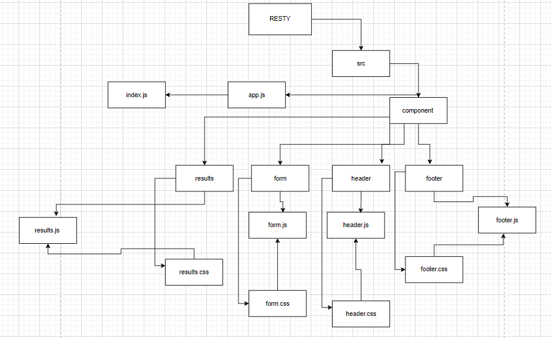

# Component Based UI 

## Lab 26 : branch base

***RESTy Phase 1: Begin work on the RESTy API testing application***

-----------

# Phase 1 Requirements

Today, we begin the first of a 4-Phase build of the RESTy application, written in React. In this first phase, our goal is to setup the basic scaffolding of the application, with intent being to add more functionality to the system as we go. This initial build sets up the file structure so that we can progressively build this application in a scalable manner

# Technical Requirements / Notes
The application, as written by our development team was done using class components as a proof of concept. In order to go to production, we’re going to have to convert this to an application written using React function components so that our foundation is both stable and high performing.

## Refactor the RESTy application as follows:

1. Convert all child components of App.js from classes to functions.

   - The App component serves as the container for all sub-components of this application.

   - Leave this component as a Class.

   - Make sure all base styles for App are included in a .scss imported within App.js.

   - Ensure that the `Header`, `Footer`, `Results` and `Form` components are imported using ES6 import syntax.

2. Use .scss files to style each component

   - Each of the components use their own .scss file for styling.

3. Core application functionality should remain unchanged:
   - The `<Form>` component should:

     - Call a function on submit that updates the `<App/>` component via a function sent down as a prop so that the app can process the form values.

   - The `<Results/>` component should show mock API results.

# UML

# Sand Box 

[CodesandBox](https://codesandbox.io/s/agitated-hodgkin-moykuw)

[liveURL](https://moykuw.csb.app/)
